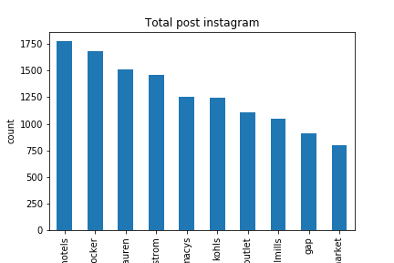

## Analyze the top brand's instagram Data 
- analyze 1: the main goal is to analyze each top brand post how many instagrams and the focus situation of their each instagram
import the instagram database, combine the likes and comments into one focus column, then get the dataframe. The other dataframe is counting how many instgrames posted by each top brand and draw a bar chart to compare.

from the bar chart, the conclusions are:
1. most users do not like comment, most social action are just click likes.
2. some top brands post lots of contents but get little focus, such as loewshotel, nordstorm, macys, generalmills, i think they should fire their public relation department, they pay a lot on the instagram but get little focus, while on the other hand nike and disney do very well, very efficient public relation post, get much more focus than other top brands.

- analyze 2: Analyze photoes companies posted filter and which kinds of filter viewers enjoy.
first i get all filter persentage that used in instagram, find the top 10 filter companies like to use in their picture, Lo-fi, Amaro, Mayfair are most popular filters.
But when i try to combine the social engaged with the total filter used, i find most viewers like pictures with Willow and Sierra filter. 

Willow Use it for: Willow looks great on skin so it’s a must-use for portraits. It also works great with beach scenes and macro nature shots.

Sierra Use it for: This is a filter that works well with outdoor nature photos and photos of objects. This is probably another hipster favorite.

so in this analyze, the conclusion is that when post a nature photos just pick sierra filter, and if it is a portraits pick willow filter seems like a good idea. this can be explain why most users like nike and starbuck's picture, because they choose the right filters on their picture.

- analyze 3: analyze each instagram hashtag
first i get all the hashtags each company used in their post instagrams, then i get the average amount hashtags in each instgram they post.

and the conclusion is lowshotel, homedeposit, footlocker, nordstorm get most hashtags in sum, while on average apple, nike, disney,starbucks get most hashtags in each of their post.

That also can explain why loewshotel, nordstrom, macys get little focus, the hashtag is a great way to increase your brand popularity, but how to use it? I think hashtag should be used like nike, disney, starbucks, that each posted instagram should contain one hashtag, attract viewers with some interesting topic.

- analyze 4: which day is the best to post an instagram
in the analyze, i convert the timpstamp into weekdays, find which weekday they post their instagram, and combined with views likes and comments also draw a bar chart , i found out an interesting results.

sat and sunday viewer are more likely to view on instagram and involve into social action, which is obvious, because sat and sunday are holidays, but monday is the third higer weekday that viewers involved into social action, that may because after two days of holidays, people may not comfort with work, they just choose to view the instagram not doing the work, and after monday, viewers focus more on working, the social action is decresing, while on friday, the viewers are excited holidays are coming, they spend more time on instagram.

so i think the company should use that, on sat monday, friday and sunday, just post something important like big discount or something like that, while on other weekdays, just post something interesting that will save viewers from boring work.

- analyze 5: analyze the caption using nltk

in this analyze, i use nltk to analyze the caption, try to find out what topic viewers likes, through that i find most company's topic is related to their products.

